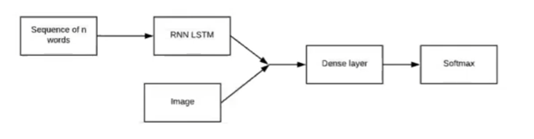
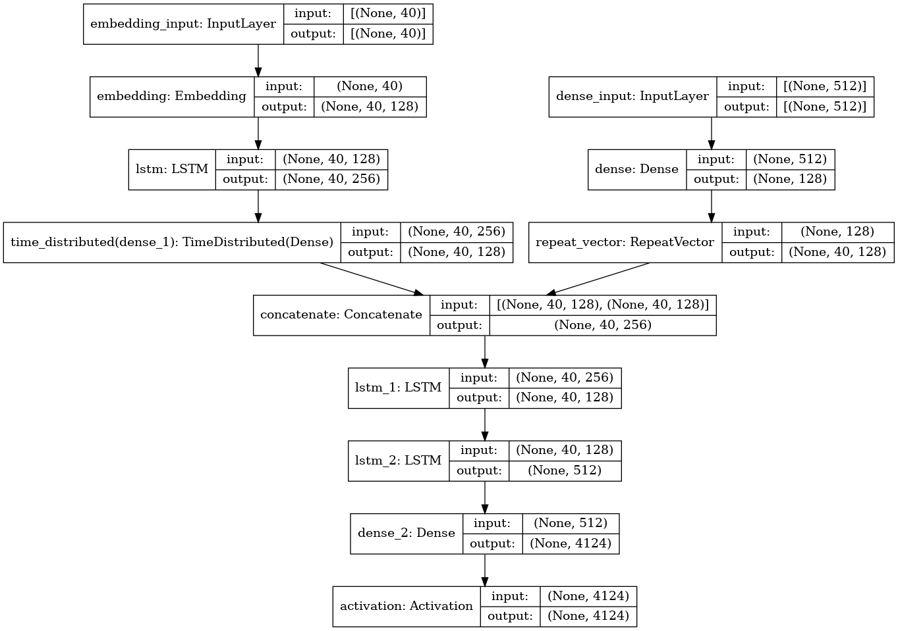

# Image Captioning App

 

## About: Used Merge model developed by Tanti et al. in 2017 as a refereance for the base model for image captioning

## Dataset: Acquired dataset from kaggle : Flicker8k

 

- ### Here i used Tensorflow tokenizers to get a word dictionary for encoding and de-coding for sequence processing.
- ### Used Tensorflow library for preprocessing the text data.

- ### For giving the image input to the model, I used various different architecture's for transfer learning.
- ### Got the best loss by using VGG16. Rather then using cool architecture focused to solve the business problem with the best solution possible.

## The model used for input of the processed data as:

